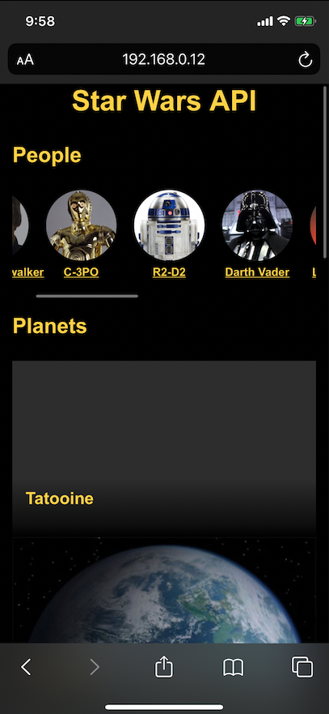
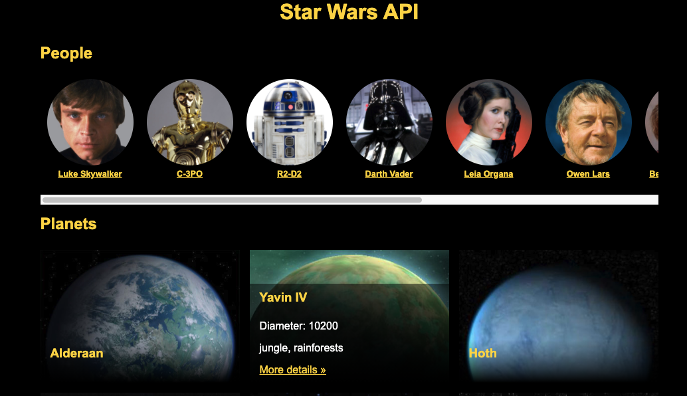

# ReactJS Star Wars API

This is a ReactJS web App that provides REST info about Star Wars characters and planets.

This source use Webpack and requires **NodeJS** v8.13.0 and **NPM** to run.

To start develoment, after clone this repository run in the saved directory.

```
npm install
```

To start develoment watcher (included local server)

```
npm run start
```

## About this project

This project was only created as a demo of SWAPI use, please feel free to clone and extend.

ReactJS was used for this demo with React Hooks


## Screenshots

### Mobile 


### Desktop 



## References

Data Source : https://swapi.dev/ 

Image Source : https://starwars-visualguide.com/

React Hooks : https://reactjs.org/docs/hooks-intro.html


> Star Wars and all associated names and/or images are copyright Lucasfilm Ltd.
